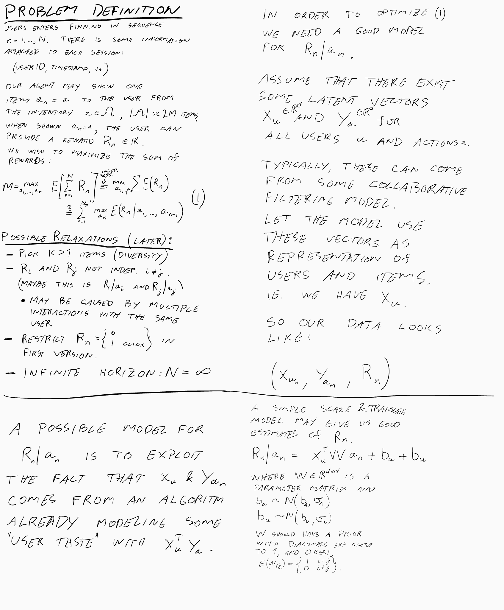
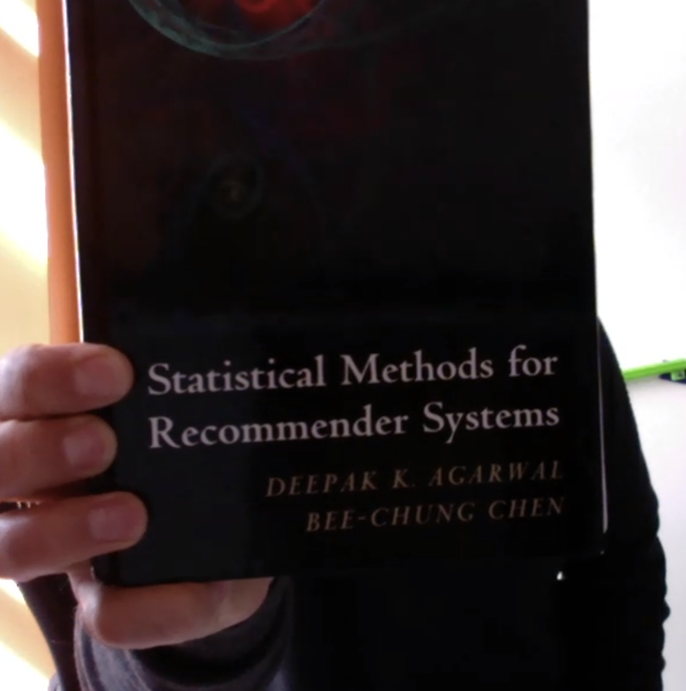

Quick chat with David. I showed him my ideas for how to build a bandit:

General feedback: this is the right way. Go fit some data to this setup.

Possible readings:

- This book has some models that are similar:

- Microsoft paper on large scale click prediction:
http://quinonero.net/Publications/AdPredictorICML2010-final.pdf

- Lastly, possible tutorials on bandits:

  + Steve Scott is a good place to quickly get up to speed on bandits: <http://www.economics.uci.edu/~ivan/asmb.874.pdf>.

  + There’s a good tutorial on the theory of these things at <https://pdfs.semanticscholar.org/presentation/a32b/b67c2d1cc4d03219ec554557b80e4a335073.pdf>, but it’s pretty heavy going if you just want to use them.
  + I hear the recent tutorial by Russo and Van Roy <https://arxiv.org/abs/1707.02038> is quite good too - certainly the abstract is promising!
