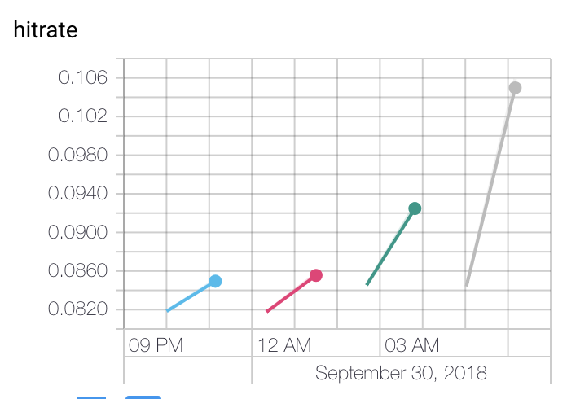

## Stage 1: a rnn with fixed item representation

## Stage 2: Also train the item representation by sampling negative examples

The dataset is fairly simple. Provides a vector of items and a userId per itemvector.

``` python
class SequentialDataset(Dataset):
    def __init__(self, df, param):
        self.df = df
        self.item_vecs = pad_sequences(df['x_items'], maxlen=param['total_length'], padding='post', truncating='pre')

        l = lambda x: len(x) if len(x) <= param['total_length'] else param['total_length']
        self.seq_lengths = df.x_items.map(l).values.tolist()

    def __len__(self):
        return len(self.df)

    def __getitem__(self, idx):
        sample = {
            'items' : self.item_vecs[idx,],
            'userId_idx' : self.df['userId_idx'][idx],
            'seq_lengths' : self.seq_lengths[idx]
        }
        return sample
```

``` python
class SequenceModel(nn.Module):
    def __init__(self, item_dim, hidden_dim, dropout,
      lstm_layers, num_items, pretrained_itemvec = None):
        super(SequenceModel, self).__init__()
        self.item_embedding = nn.Embedding(embedding_dim=item_dim, num_embeddings = num_items, max_norm = 1.0)

        if pretrained_itemvec is not None:
            self.item_embedding.weight = nn.Parameter(torch.from_numpy(pretrained_itemvec).float())

        self.lstm_layer = nn.LSTM(input_size = item_dim, hidden_size = hidden_dim,
                                  num_layers = lstm_layers, batch_first=True, bias = False, dropout = dropout)
        self.rnn2item = nn.Linear(hidden_dim, item_dim, bias = False)
        self.linear = nn.Linear(1, 1)

    def get_item_embedding(self, x_items = None):
        if x_items is None:
            x = self.item_embedding.weight
        else:
            x = self.item_embedding(x_items)
        x = x/torch.norm(x, p = 2, dim = len(x.size()) - 1, keepdim = True)
        return x

    def get_taste_vector(self, x_items):
        item_emb_vecs = self.get_item_embedding(x_items)
        x, _ = self.lstm_layer(item_emb_vecs)
        x = self.rnn2item(x)
        x = x/torch.norm(x, p=2, dim=2, keepdim=True)
        return x

    def forward(self, x_items, idx = None):
        m_weight = self.get_item_embedding(idx).t()

        tastevec = self.get_taste_vector(x_items)
        outputs = torch.matmul(tastevec, m_weight)
        outputs = torch.tanh(outputs*torch.abs(self.linear.weight) + self.linear.bias)
        return outputs

```

There exist about 2m items in the inventory.
Calculating the negative loglikelihood for all these candidates are way too computationally intensive.
Instead, the model uses the trick of negative sampling.
For every batch, we sample 15'000 items. All the target classes in the batch are included,
which is an heuristic way of sampling more popular items more often.

``` python
def sample_candidate_items(targets, indexes, device, sample_size = 400):
    unique_targets = targets.cpu().unique()

    if len(unique_targets) > sample_size:
        raise Warning("Unique targets larger than sample size.")

    while len(unique_targets) != sample_size:
        neg_samples = sample_size - len(unique_targets)
        rand_idx = torch.randint(high = len(indexes['ind2item']),
                                 size = (neg_samples,)).long()
        idx = torch.cat((unique_targets, rand_idx))
        unique_targets = idx.unique()


    return unique_targets.to(device)
```

## Stage 3: Add timestamps to model


## Stage 4: Add content

## Stage 5: Add more signals


### Experiment: Add contextual data to events
There is an added value of adding what type of signals used in the models.
When all ingredients are present (itemId, age of event, type of interaction and source of event), we get a hitrate 10% better than the next best (from 9.4% to 10.6%).



