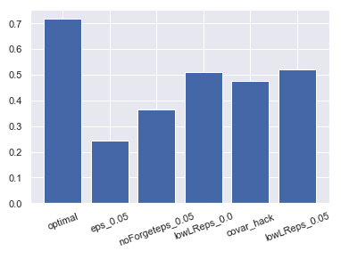
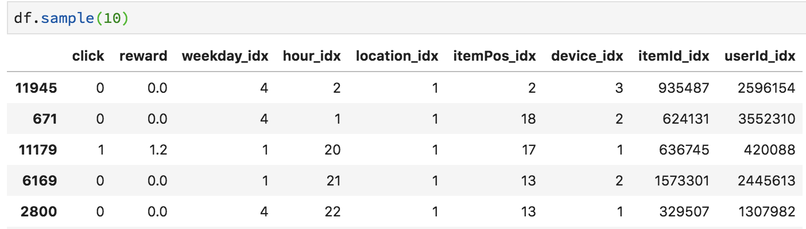
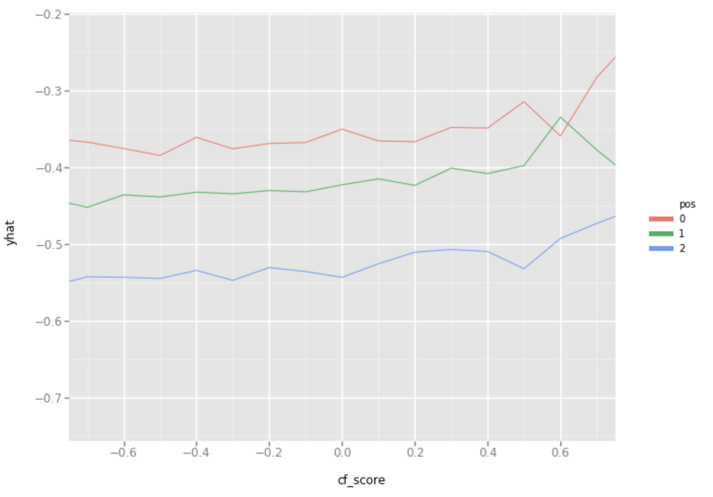
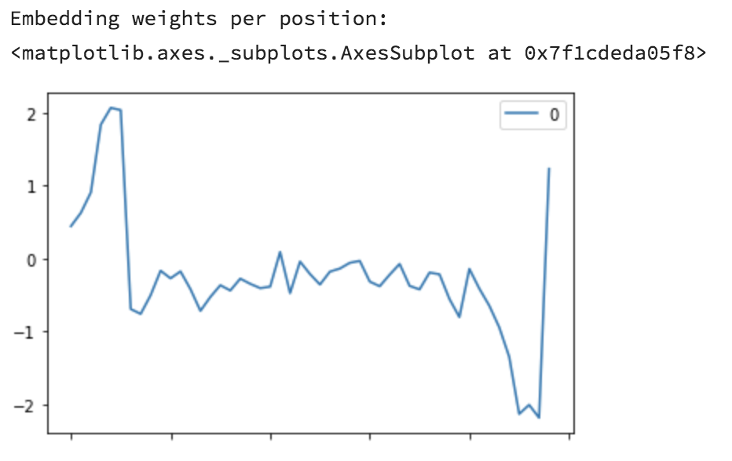

# Arnoldo Meeting 20 dec 2018

## Discussed meta
- two different models:
 - with one underlying submodel
 - with concatenated submodels with missing data


## In lancaster, simen should present the following:
- progress on  meta models
- bayesian models
- Sequential recommendations

Prepare well, and go into details

## send to arnoldo
- paper on RNN rec
- the evaluation paper on different recs
- bayesian exploration paper
-

# Online results

## meta-bap-bandit på bap-browse
Meta-modellen med bap--browse-bandit drar inn rundt 1000 klikk ekstra om dagen: fra 18.4% til 19.4% i klikkrate. Det er en økning på 5%. Det er en liten økning i reward siste uka (etter at modellen stabiliserte seg).

Foreslår å gi 100% trafikk til bandit-modellen.


fordelingen av de forskjellige submodellene viser at bandit-submodellen (orange) enten er den mest brukte eller nest mest brukte modellen og har høyest eller nest høyest klikkrate:


Reward (weekly):


## car-browse-bandit on car-browse
Car-browse-bandit har en betydelig høyere klikkrate enn de andre alternativene på markedsforside bil.

Hovedårsaken til forskjellen mellom used_car_rot_infused og used_car_als er utvalget den kan anbefale mellom, der sistnevnte kan anbefale for alt som har vært aktivt, mens førstnevnte kun kan anbefale siste 10 dager (eller noe slikt).

Forskjellen mellom car-browse-bandit (23.6%) og used_car_als (22.0%) er på *7% økning i klikkrate* siste uke.

Samtidig ser det ut som at bandit-modellen får denne økningen i klikkrate på bekostning av konverteringer. Reward er lavest for bandit-modellen med 0.55 vs 0.6 på sammenlignbar modell. *Allikevel er det modellen som kun kan anbefale siste 10 dager som har høyest reward (selv om den hadde lavest klikkrate). Det ser ut som det er fordelaktig for disse modellene å bli begrenset på hvor gamle annonser de kan anbefale*.

Foreslår at vi lager en ny AB-test her hvor vi beholder finn_used_car_als_60d_rot_infused og setter opp en ny bandit-modell med samme item-strategy for å teste også denne kombinasjonen.


# Implementation of Bayesian matrix factorization through mcmc

- Implemented an mcmc for the model using movielens 1m dataset.
- Compared with spotlights explicit model
- Code and results can be found [here](https://github.com/simeneide/phd-notes/blob/master/general_notes/bayesian_MF.ipynb).
- How to adapt this to the implicit feedback setting?
- A possibility would be to use this model for the item side, but modify the user side to be an rnn. Then one can alternate between training item and user side. Gives you a semi-bayesian model.


# progress meeting 30 nov
With: David, Arnoldo (first 50%), Simen

What have Simen done:
- Released two models into production
  - The car model have 35% increased click rate but lower conversions. Also, found that the item candidate sets are different in the AB test. Will roll out new with same item candidate set.
  - The general merchandise model is released into a meta model. Seems to work well at the moment, but very early.


- Starting to read suggested papers related to Davids link on [Online Bayesian Deep Learning in prod at tencent](https://www.inference.vc/online-bayesian-deep-learning-in-production-at-tencent/).
- Read and presented paper “Bayesian Probabilistic Matrix Factorization using Markov Chain Monte Carlo” [in course](https://eide.ai/post/2018-11-23-bpmf-paper/).
- Bayesian course exam
- Div FINN things (improving our image similarity model, reducing number of overly popular bodysuits in algorithm by post proc hack etc)

Simen to next time:
- Continue with online tests
- send over likelihood function work we did
- Try to implement the [bayesian mf model]((https://eide.ai/post/2018-11-23-bpmf-paper/))
- Look at slap and spike priors (something that we can use when having multiple models concatted?)
- Continue reading on tencent paper+methods

# progress meeting 19 nov
With: David, Simen

- Discussed current model that takes three different rec.models and
  - produces a compressed feature space,
  - Trained on logged recommender events (views/clicks)
- Model does not seem to "work". The loss converges etc, but when sanity checking recommendations on real users we have knowledge about, it does not make sense.
- Tried to control for exposure/popularity, unsure if it has any effect
- Decided to limit problem to only one underlying rec system and see if we can get the "training on logged rec data" correct.
- Decided to read up on importance sampling and inerse propensity.
  - Possibly a problem with variance here..

# Progress meeting 12 nov
With: David, Simen

-
- Deep learning with bandit feedback
  - Dividing by sum of probs is normalizing constant

# 12 nov: Meeting with finnAIR
With: Joakim, Olav, Simen

- presented MAB and recommender simulator
- Reasons for why no exploration might work:
  - Stochastic gradient descent might accidentally do some kind of efficient exploration of neighbourhood.
  - Maybe the model is continuously translating and therefore is exploring because some items are moved before others.

- Possible things to investigate:
  - create an environment that has two modes: the "efficient" greedy algorithms will then just find local optima. an epsilon greedy will jump between the modes and end up in the optimal one.
 - Change optimizer into a non-stochastic one:
   - use all data when doing opt step
   - find MLE every time.

---


# Work on recommender simulator after 2.nov

### Work on implementation on the vector bandit model

- First results gave weird recommendations. may it be that this is the unexplored area of the model?
- Fitting a policy on other logged data.
- Weigh observations by popularity seemed to help (an exposure model)


### MAB extensions

- read in bandit book
- started to read on UCB


### Work on paper: " Causal Inference for Recommendations"

- They split the recommendation problem into two subtasks:
 - **Exposure model**: Build an exposure model, modelling how likely a user u will be exposed to an item i (exposed: $a_{ui} = 1$).
   - Two different exposure models:
     - $P(a_{u,i}) = Bernoulli(\alpha_i)$ aka popularity model
     - $P(a_{u,i}) = Poisson(\pi_u^T \gamma_i )$, i.e. a poisson matrix factorization
 - **Click Model:**: Given exposure, what is the probability of being clicked:
   - $P(y_{ui} | a_{ui} = 1) = N(\theta_u^T \beta_i, 1)$

- The two models are trained independently. First fit exposure model and then fit click model. The probabilities from exposure models are used to weight the data in the click model. (importance sampling idea)


#### Spin off on this model
- Can we find the information matrix on the click model and use a normal approximation to get an approximate posterior? If so, we have uncertainties in the user- and item vectors!
- Have done some calculations on likelihood.
  - Need to redo calc and add prior.
- Are the unimodal requirements satisfied?

### Work 6 nov: Fix unstable training + add variance hack + "No need for exploration"

Experiment with U=I=100 and steps = 20k.

Main findings:

- Needed lower learning rates for stable optimization
- Not really any need for any exploration to solve the environment.
- Not really sure that the variance hack Arnoldo suggested will work: The parameters does not converge to the right one, but can "circle around" as we can only get up to a factor of truth (from discussion which arnoldo already pointed out).
- In general: way too unstable environments to get consistent results. Move to bigger computers?
- Qualitatively same results with U = 100, I = 1000, d = 50



https://github.com/simeneide/phd-notes/blob/e612c2ce0032e9a203731a911229c09f07b03f13/general_notes/simple-recommender-eps-greedy-covarhack.ipynb

----
# Progress and work meeting 2. nov
With: David, Arnoldo, Simen

- Milestone: phd-application delivered to UiO.
- Went through the two simulations (beta-bernoulli and rec simulator)
- Discussion of the likelihood models Simen set up for meta vec (only Arnoldo+Simen)

####  Beta-Bernoulli:
https://github.com/simeneide/phd-notes/blob/master/general_notes/Beta-Bernoulli-thompson.ipynb

  - eps-greedy can do reasonably well if tuned carefully, but never very well.
  - Short number of steps is a bit troublesome for all of these heuristics - a Gittins index approach is viable here, and will likely outperform them all. So short runs should be used to gain intuition for long runs only.
  - Thompson does moderately well without much effort. Usually something can be carefully tuned to the specific problem in hand, if you know enough about what is coming before it gets there.
  - The more exploitative policies have higher variance.
  - Parameterising the posteriors for decision-making is a useful thing to do. I did something extremely similar in a game theory paper that never quite got written.
  - Ben May’s proof of convergence of TS is valid for your “tuned” posteriors. I don’t know whether things like Shipra Agarwals regret proof can give any insights as to whether it’s a good thing to do.

Conclusions:
- Read and understand and possibly implement gittins index. (james E will send his implementation and paper submission)


#### Simple Recommender simulation
- https://github.com/simeneide/phd-notes/blob/master/general_notes/thompson-sampling-simple-recommender-simulator.ipynb

##### Creation of simulator
Feedback:
- Is the simulator actually creating uniform users/items on the hypersphere?
- Simulator does not provide positive click probabilities (as its only a dot product between two arbitrary unit norm vectors). Do some logit transform to ensure [0,1]?

##### Model
- Many components: It is difficult to understand all effects, and the algorithm have too many moving parts: the model (MF), the optimization method (SGD) and the data forgetting (ReplayBuffer).
  + Unsure of exactly how to reduce this problem. If one is completely training a new model at every step, one would get issues of overfitting (unless doing some train/test split).
  + All optimizers are good/bad. Possible to make some simple but robust versions? Dont need to be optimal..

- The preference vectors are unobservable.

###### Exploration with current model (likelihood)
Currently just doing epsilon-greedy on the current model. We need some uncertainty in the model parameters to explore more efficiently (i.e. thompson).

David proposed that we should estimate the uncertainty of parameters so that we could sample from these distributions and get thompson exploration. We all agreed. However, after

Simple parameter uncertainty:
- During training of parameters, take last k steps of training and calculate the covariance $\Sigma$ of the parameters. Then we can sample the uncertainty in our parameters with something like $x_u = N(\hat{x_u}, \Sigma / k)$. However, is still valid when we can only get the vectors up to a factor?

Proper parameter training:
- Build the full likelihood function on both the user vectors x_u and item vectors y_i, and find mle by setting all $\frac{\partial l(data)}{\partial x_u} = 0$, $\frac{\partial l(data)}{\partial y_i} = 0$. This will be very messy as there is so much interedependency.

Conclusions:
- Add stochasticity of model parameters and make a exploratory model that samples from this instead.

- Send over some reading material on SGD for A.

#### Likelihood models
- Arnoldo seems to be puzzled with my $x_uWy_i$ constructed model. I do agree that Ive not seen it before either.
- Arnoldo liked the two layer approach better, and that one is probably the one to focus on.
- Unsure of the normalization layer $x = Wx/|Wx|$. Instead, can we put some boundaries on W such that $|Wx| = 1$ whenever $|x| = 1$?. Arnoldo suggested to search "idem potent" matricies
---

# Progress meeting 16. oct
With: David, elja, Arnoldo, Simen

- Short intro Simen / Elja
- Discussed what happened at recsys18: quite some focus on bandits.

Tasks for now:
- Simen: links to paper in blog post
- Arnoldo + David read through blog
- Simen: Links to papers in post
- Simen: Resend example implementation of meta-bandit
- Simen: Try build a user-item bandit
- Simen: Try to set up model (same with arnoldo+david)

# Skype meeting 1. okt
With: Arnoldo, David, Simen

- Simen went through Data1 vs data2
  + Confirmation from arnoldo and David that this makes sense
- Simen went through first meta-model
  + Feedback ok
  + maybe plot embedding+regression factor for embedding plots for visualization
- Simen gave a brief explanation of the simulator he created.
  + Tried it with Bernoulli-bandits.
  + Stated the weird result that thompson is worse than greedy+epsilongreedy.
  + Pass code around.

To do:
- Get more done on RNN recommender (wrap up at some point?)
- Get some meta-vec bandit model into production to get a benchmark against current model
  + Add some more submodels first?
  + David: Tweak cf_score with some translation or trainable?
- Simen will be on conference this week + holiday next. Next meeting: 16th oct

----

# Progress 22 sept

In this progress:
- RNN recommender
- Russo paper
- Idea of data1 vs data2 (rec sys data paradox)
- Implementation of first meta vector model

Things done:

#### RNN Recommender
- Partly unrelated to the phd-projects: Development of an Recurrent Neural Net recommender with evaluation of negative examples.
The model takes in a vector from one user of consumed items. Then, it tries to predict the next item the user will consume. Earlier implementations I have done has only predicted a fixed vector (that is obtained from a different model). The new sets of algorithms are actually using a logistic regression to evaluate negative examples as well. Since there are 2m negative examples at every point, it is only sampling some negative examples (15k items) due to computational constraints. By sampling negative examples, it allows the algorithm to also consider the item vectors as parameters.
- One of these has been into production at FINN.no and is one of the top performing models in the meta model. A new model using not only the sequence of items, but also the timestamp of when the item was clicked is on its way out. Further improvements such as including category of the items, the type of interaction (pageview vs sending a message on the item), is something we should try out.

- In general: Sequential recommenders (using recurrent neural nets) are becoming the industry standard at the moment.
The model is inspired by e.g. http://alexbeutel.com/papers/rrn_wsdm2017.pdf

Might be good for **supervisors** to read/skim through?

#### Russo
- Read the Russo paper "Introduction to Thompson sampling", and further discussed this with Arnoldo. An interesting discussion came out of this regarding greedy, "frequentist Thompson" and Thompson. In the context of bernoulli bandits:
 + Greedy: Estimate the click probabilities per arm and choose the highest one.
 + "Frequentist Thompson 1": Estimate the click probabilities of each arm. Then sample a bernoulli from this and take the highest sample. The idea was that you then get some exploration. REMARK NOW: Not really sure how this would work, as you would sample a sequence like (0,0,1,0,1,0). Since what you sample is binary, you cant decide between arm 3 and 5 (in this example). Improvement: Do some bootstrap where you sample each arm n times and take the average performance.
 + "Frequentist Thompson 2 (with law of large numbers)": Assume $P(success in arm 1 ) = \theta$. Sample n draws from this distribution (theta_1, theta_2, ..., theta_k). Then 1/n * sum(theta_i) is Norm(theta, sigma/sqrt(n)) (or similar). Hence we have a mechanism to reduce the uncertainty in our parameter when we have tested an arm many times. This is an important property.
 + "Proper Thompson": Bayesian: Add priors and everything...

**David**: Do you recognize frequentist thompson 1+2 by some more used names? I am sure these things have been explored in the context of bandits...
 + David: Freq Thompson 1.5: From economics literature: Probability Matching / Probability Sampling
 + David: Uncertainty sampling: Then 1/n * sum(theta_i) is Norm(theta, sigma/sqrt(n))

#### Data 1 vs Data 2 (the recommender system data paradox)
My head has been spinning with this concept for a while, and I believe it makes sense to write down a bit on it.
I believe there is a data paradox in recommender systems litterature:

> We do not use recommendation data to train recommender systems!

When training recommender algorithms the signals are all {user, item} iteractions done by the user, no matter how the user found the item she interacted with (Data 1). For example, if I watch an episode of Games Of Thrones on HBO, that is a positive interaction. It does not matter whether I used the search tool, got a link from a friend, or was recommended the item by HBO.

On the contrary, when we evaluate a recommender algorithm (in production) we typically look at click rates. That is, we want to choose models that are best at pickling items we will click on if shown:

> P(click | we show item i)

This is a very different problem from the one solved by using Data 1. We also have a very different dataset for this problem: the show/click events from our recommendation product. I will call this Data 2.

There is a good reason for using data 1 in building recommender systems. Usually, there is a lot more going on to an internet platform than the recommendation engine. Only using data from your rec engine will essential throw away all the useful interaction done in other parts of the platform (search engine ++). However, not using Data 2 also misses out a lot, as this contain the data of what you really want to optimize. It also allows for exploration of user preference by recommending items that is not optimal from a Data 1 point of view.

I believe that there is great potential in combining Data 1 and Data 2. The meta models is one way of doing this.


#### Implementation of Meta Bandit Vector Algorithm
I have done a first round of implementation of the meta bandit vector-algorithm (working name, suggestions welcome!). The general idea is to utilize an algorithm created in Data 1, to optimize click rates using Data 2.

##### Data 2
I am focusing on the recommendation location at the front page of FINN.no. It is a personalized feed that can show up to 48 items to a user. It starts by displaying 6, and then adds 6 and 6 as the user (potensially) scroll down the site. We log each display as an "inScreen", and log each click on either of the items as a "click".
On a daily basis, there is around 200k clicks, and we show approx 48M items to users (or 1M full 48 feeds). The probability that a users clicks on one of the 48 items is therefore around 20% (=200k/1M).

After cleaning and massaging the data, we get a table looking like this:



Here, each row is one of the 48 items shown to a user.
We register the user (userId_idx), the item proposed (itemId_idx), the position the user saw that item in (itemPos_idx), and whether the user clicked or not. In addition, we have the "reward" that FINN gets from an interaction (this is an index saying whether the user converted and on what kind of item the user converted), as well as a lot of normalizing variables: weekday, hour of day, device (mobile/desktop) and location (only frontpage now).

##### The first meta vector bandit

> Idea: We use pretrained algorithms in data 1-land to improve our model trained in data 2-land.

We have:
- the data specified in Data 2 above.
- A set of pre-trained vectors $x_u \in Rˆd$, for all users $u = (1,.., N_u)$
- A set of pre-trained vectors $y_i \in Rˆd$, for all items $i = (1,.., N_u)$
- All our normalizing variables are one-hot encoded, and given parameters w_{weekday}, w_{itemPos}, ...

For every data point, we wish to model the click probability.

Create a variable that we will call the CF-score by the following:
$$
CF(X) = x_uˆT y_i
$$

Define a vector of the CF score and all normalizing parameters:

$$
Z = [CF(X), w_{weekday}, w_{itemPos}, ... ]
$$

Then, transform Z into 2 values representing the logits of click probability:

$$
\alpha = BZ + c
$$
where B is a parameter vector, and c is a constant.

Finally, the click probability is modeled as:

prob(click | X) = \frac{exp(\alpha[1])} {exp( \alpha[1] + \alpha[2])}

The following code implements this model as a pytorch model:

``` python
class BanditVec(nn.Module):
    def __init__(self, pretrained_weights, norm_ind2val):
        super(BanditVec, self).__init__()

        ### Layers
        self.scalelayer = nn.Linear(len(norm_ind2val.keys()) + 1,2)

        ### User Item Embeddings
        self.emb = nn.ModuleDict()
        for name, w in pretrained_weights.items():
            self.emb[name] = (nn.Embedding(num_embeddings=w.shape[0],
                                          embedding_dim=w.shape[1])
                              .from_pretrained(torch.from_numpy(w).float(), freeze= True)
                             )

        ### NORMALIZE EMBEDDINGS
        self.normemb = nn.ModuleDict()
        for name, _ in norm_ind2val.items():
            self.normemb[name] = (nn.Embedding(num_embeddings = len(norm_ind2val[name]) ,
                                          embedding_dim = 1)
                             )

    def cf_score(self, batch):
        uservec = self.emb['userId'](batch['userId_idx']).squeeze()
        itemvec = self.emb['itemId'](batch['itemId_idx']).squeeze()

        score = (uservec * itemvec).sum(dim=1, keepdim = True)
        return score

    def forward(self, batch):

        # Calculate the score between user and item by multiplying pre-trained
        # user/item vectors (divide by 100 for numerical stability):
        score = self.cf_score(batch)/100

        # Add one hot encoded covariates from the normalizing variables:
        normscorelist = []
        for col in norm_ind2val.keys():
            s = self.normemb[col](batch[col + "_idx"]).view(-1,1)
            normscorelist.append(s)

        # Add the user/item score to the list of covariates
        # and concat them into a vector
        normscorelist.append(score)
        covariates = torch.cat(normscorelist, dim=1)

        # Do a linear regression layer on the covariates
        # and produce two logits:

        score = self.scalelayer(covariates)

        return score

```

I have done a fast training of this model on a subset of the data described above. I use the crossEntropy Loss to minimize the function.

The loss converges fine, and by inspecting the model, I do get some statistics out that makes it seem to converge to something useful. For example, there is a positive relationship between the cf score and the probability of click (logit value in y axis):


 

The same plot also shows that the click probabilities decreases as item Position increase. It can also be seen by inspecting the $w_{item_pos}$ directly: (note that these plots may be inverted around zero as it is only an input to a regression model and gets multiplied by an arbitrary weight parameter)



Also, the model finds a "smooth" relation to the hour of day:


There is much more we can say about this, but Ill stop here. There is also many extension we can do, like the xWy translation of the vectors I proposed earlier. (I actually implemented this, but Ill present results later).

----

# 14 sept -  Progress meeting

Arnoldo, David and Simen agreed that the vector-bandit model note is a good start. No need to focus very much on whether it is bayesian or not: "make it work first".

#### Until next time:
- Read the Russo paper (https://arxiv.org/abs/1707.02038)
- Build a first iteration of the vector bandit and present to group.

---

## 11. sept: Skype with David
Quick chat with David. I showed him my ideas for how to build a bandit:


General feedback: this is the right way. Go fit some data to this setup.
- Misspelling in bottom half: $a_n$ and $y_a_n$ is the same thing.


Possible readings:

- This book has some models that are similar:


- Microsoft paper on large scale click prediction:
http://quinonero.net/Publications/AdPredictorICML2010-final.pdf

- Lastly, possible tutorials on bandits:

  + Steve Scott is a good place to quickly get up to speed on bandits: <http://www.economics.uci.edu/~ivan/asmb.874.pdf>.

  + There’s a good tutorial on the theory of these things at <https://pdfs.semanticscholar.org/presentation/a32b/b67c2d1cc4d03219ec554557b80e4a335073.pdf>, but it’s pretty heavy going if you just want to use them.
  + I hear the recent tutorial by Russo and Van Roy <https://arxiv.org/abs/1707.02038> is quite good too - certainly the abstract is promising!

----

# Progress 3. sept 2018

What I have done:
- Lancaster Kickoff
- phd funding application
- Start ideas on making a meta-recommender based on pretrained vectors
- Reading&ex in course
- Partly on side: Implemented a Recurrent NN recommender that tries to predict probability of what item will be consumed next. In A/B testing now. (http://dx.doi.org/10.1145/3018661.3018689)

Next steps and ideas as discussed (and self planned) after Lancaster kick-off:
- finish funding application
- Bayesianify the meta model in some way.
- One problem is that these submodels does not contain any really «large» uncertainty: A bad submodel may give a score of 0.5 to one relevant and one irrelevant item. The meta model cant really use this to determine between the two.
- The real uncertainty may be within the submodel
- Might be more interesting to consider the vector spaces from submodels and their translation into a reward function (click prob). More general, and more usable in different scenarios. Also allows the action space to be all items in inventory, not just (top k)*(# submodels).
- 	For this missing vectors need to be considered.
- 	Is it a problem that training data may be older than vector generation?
- 	Should this «super model» contain latent variables itself?
-      The "agility" of models such as "similar to last seen" and "Popular" will not be able to be as dynamic in the new setup.. this will hurt relevance during production.

Other interesting things Id like to try:
- How to use mcmc when data increase/change?
