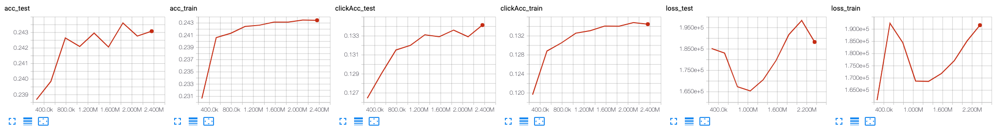
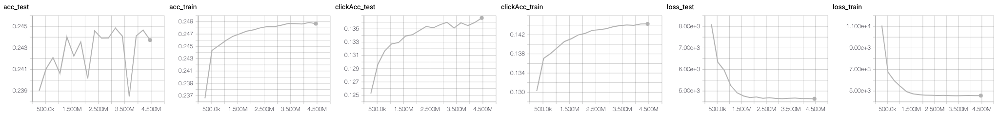
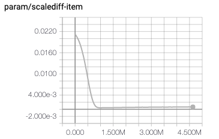
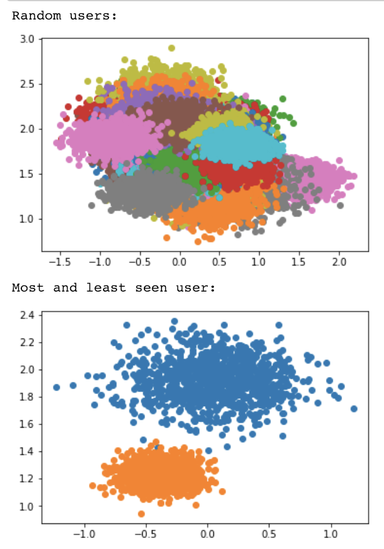

# Between trondheim and 19 june
- Rewritten the paper to not be an amortized thingee, but rather an actual bayesian RNN.
- Some discussions interally with finn about publishing the dataset. Positive feedback from privacy stakeholders in finn, we should go ahead on this(!).
- Have implemented a mean-field VI algorithm that assumes all model parameter indicies are independent gaussians
  - RNN parameters are N(0, 0.5)
  - each index in the item vector parameters are either 
    - if it has a pretrained weight: N(pretrained_val, 0.01)
    - if it does not have a pretrained weight: N(0,0.05)

### Constant parameter for the noClick option
Had to introduce a separate parameter that captures the average propensity to choose noClick. Otherwise the $z_t \cdot v_i$ part of the model seems to only focus on modelling this and forgetting the fine differences between items.

### Large item norms
 When I kept the item vectors constant, I managed to get decent results. However, when Ive tried to also train the item parameters it seems to collapse into recommending only a few items no matter what you looked at (the most popular ones it seems). Looking at the model afterwards, I suspect that it is because the norm of those item vectors become large and therefore the score will be high as long as the dot product is positive ( z*v = |v| * z* (v/|v|). Will look into it more, e.g. trying to limit norm of vectors. also suspecting a bug somewhere.

This might be a similar problem to the constant parameter for noClick option.

### The item-sampling in Stochastic VI
The optimization algorithm is based on stochastic optimization. However, this is usually done when there is a set of global variables and a set of local variables.
We also have a set of semi-global variables (the item vectors $v_i$). The item parameters are also subsampled at each step to reduce computation time (there are potentially 4m of them, but only 100k that touches each subsampled likelihood).

I did a naive sampling of these by only sampling it whenever the likelihood used the specific index.
This causes a huge bias in the expected gradient, as the popularities of the items are very different. 
Effectively will popular items be regularized much more towards the prior than unpopular items.
A curiously of this was that my loss was increasing over iterations, although accuracy increased. Must be due to the very weird sampling done:

This was also seen in the results, where the $argmax_i z_t^u \cdot v_i$ recommended curiousity items rather than well-seen ones:

A quick fix was obtained by sampling 3x as many items uniformly as appearing in the sampled likelihood function. This would reduce the bias between the true gradient of the posterior and the smapled one, however it is not unbiased. Both loss, accuracy and recommendations now look more sane, however it seems the effect is still there. (maybe not unbiased enough?):

I am also worried that I have missed something on conditional independence etc. Will read more on details of stochastic optimization (in specific working on [http://www.jmlr.org/papers/volume14/hoffman13a/hoffman13a.pdf](Hoffman, Blei 2013: Stochastic Variational Inference). 

Another clue here that I dont understand is that for the item vectors, the scale parameter in the variational inference is converging to the prior exactly. This is the absolute difference between posterior and prior scale of all item vector indicies:

# Trondheim NAIS days (28-29 may)

- We are happy with the data model
- We had a lot of discussion on whether the structure should go into the model or the variational distribution
  - Could it be so that having structure in q() is the same as "putting the structure in the model" and maximizing pointwise?
  - We concluded that we have never put any structure in the VI, so we will go with putting it back into the model.
  - Now: The RNN is back in the model, with priors and posteriors for rnn parameters W, b etc.
- There are two ways of optimizing the model, and we discussed whether we should use mcmc or VI. The group is heavily split on previous knowledge and previous investment in framework understanding.
- If MCMC: Effcient mcmc options: firefly mcmc (Ryna Adams), stochastic gradient langevin mcmc (nemeth)

- Does an RNN with model parameters create enough uncertainty in user preferences?
  - There is huge amounts of data, why does not W and b converge to point estimates?
    - Arnoldo argued that if there e.g. is a bimodal distribution, W should should between the two modes in the posterior. This will not be the case for a gaussian approximated VI.
    - If the likelihood is flat, then we should not be too sure about W. (even although we got massive amoiunts of data)
  - Another concern is that all users start at the same point (typically zero).
    - Then we will not be able to fit data well in the first steps as the RNN is going towards where the user should "really be".
    - A possible solution is to introduce a latent user specific starting point. We can then infer this starting point after observing some clicks: P(h_0^u | C_{t=1,2,3})
    - If not starting point, we can also use the "transitional b's" as user specific?
      - Can we learn this in an online fashion?
        - Either we can create a VI-distribution that predicts it,
        - a particle filter that you update as you go forward.
- Should V be data or parameters? We have done a bit of both.

Policy:
- mcmc to run a mallows model on the posterior samples of scores
- It is difficult to find an optimal action if you have model uncertainty. It is much easier if you have a specific posterior sample.
- But thompson sampling works!
- argument of in-slate and full slate version works.

Not thought about at all:
- What if the scroll length rho depend on a?
- utilize the structure of the vectors better. Think of the propensities differently.

# Problems with categorical distribution in next item prediction
Claim: If all items are candidates for all next-item clicks, then the priors (and uncertainties) will be washed away quickly. This is because all items are present in the denominator of the softmax in every datapoint:

$$ \frac{e^{z_u v_a}}{\sum_{i=1}^{N_i}e^{z_u v_i} } $$

Possible solutions:
- Only have those actually seen in the denominator (will this give convergence trouble?)
- Move away from softmax and category altogether. Consider as bandit problem where we maximize reward given action. This also requires to get the views.

# What is the benefit of a bayesian model when using hitrate as evaluation?
When faced with predicting the next item, the

Given a set of recommendations $I_r = {i_{r_1}, ..., i_{r_n}}$
and a set of future clicked items $I_f = {i_{f_1}, ..., i_{f_n}}$.

# Feedback from David 25 feb
feedback on the two reports. See own doc.

- David was puzzled that we dont just use the actually seen items as negative examples. Maybe time to explore? Possible to show that it is better to know the actual items than just sampling randomly?
- David agreed that a bayesian model doesnt improve point estimate accuracy. Then standard evaluation does not work to evaluate the algorithm. What to do...?
- There is a link between the categorical and the ranking loss (equivalent in num_items=2). investigate further?

# Meeting with Riccardo
Went through the two projects.
- Possible meta model hack: create some regression on the missing data
  + Maybe just using the model containing "all users". Ie only from mul-conv to realestate.
- Add user specific bias in RNN model: Wx + Wh + b_u

# Status meeting 25 jan

Todo now:
- Write down the two projects properly with latex and full sentences. Make remarks where we need to explore more. Add references where suitable. Divide into two parts: Method and simulations.

# Advisory meeting 23 jan
*Summary email:*
Slides can be found here:
https://docs.google.com/presentation/d/126_r5pQFIfLhUhBeX_MpJjXvcbaFxQWnHtLGP_KqxCE/edit?usp=sharing

In general, work done will be posted in this repo:
https://github.com/simeneide/phd-notes

In specific, since we talked about MCMC and Variational inferences methods, the two implementations are here:

MCMC: https://github.com/simeneide/phd-notes/blob/master/general_notes/bayesian-mf/bayesian_MF.ipynb
Variational Inference: https://github.com/simeneide/phd-notes/blob/master/general_notes/bayesian-mf/SVI-MF.ipynb

And Riccardo were of course very right, the plot I showed was not from MCMC as it produced a correlated distribution. the "VI version" can be shown here:

# Lancaster meeting January 2019
So much happened and I didnt write down before two weeks later.
See own notes in onenote from sessions.

Session 1: Meta-models  
Session 2: Bayes RNN  
Thursday: STOR-i conference  
