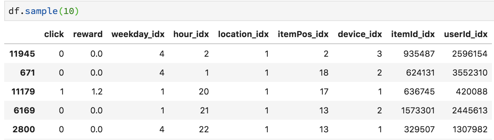
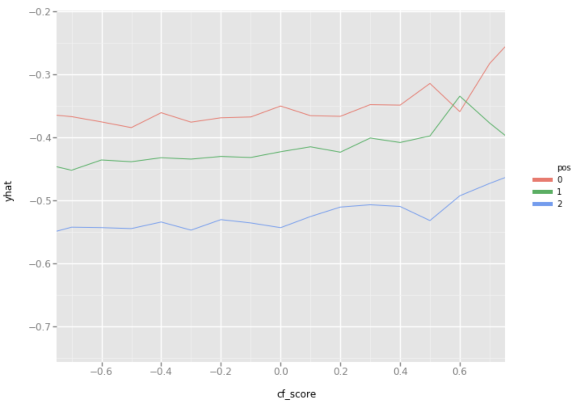
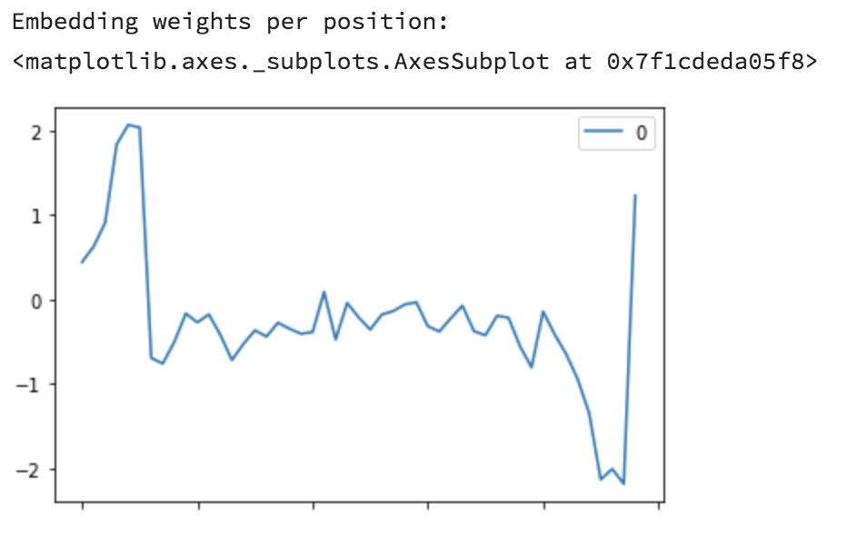
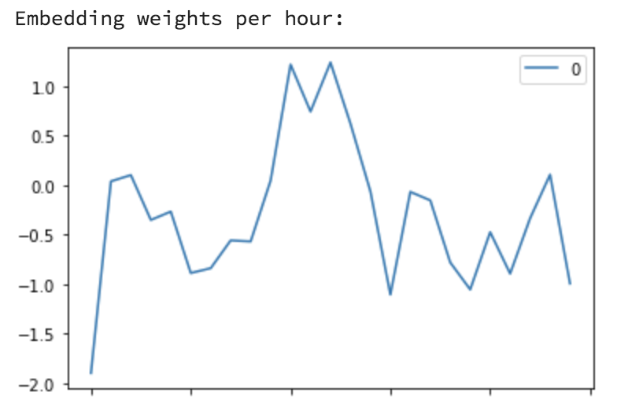
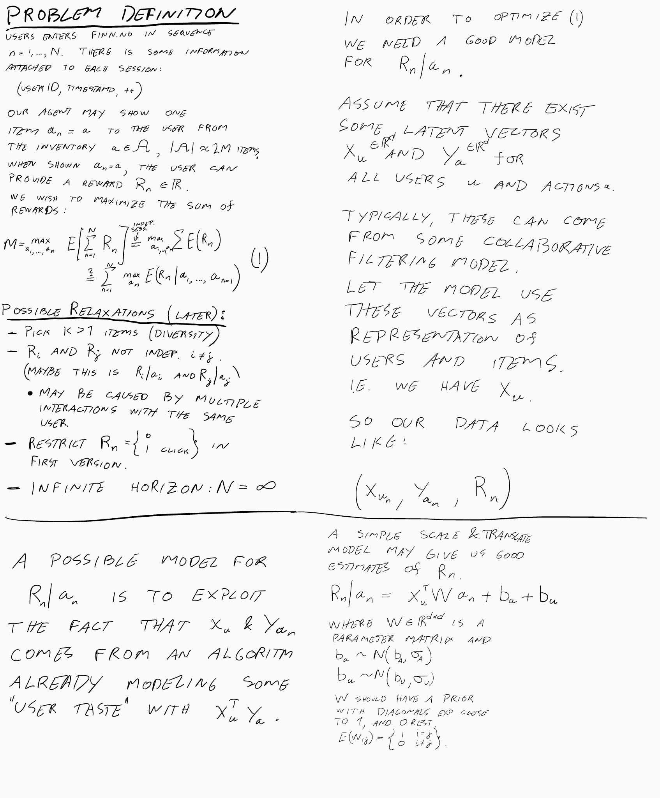
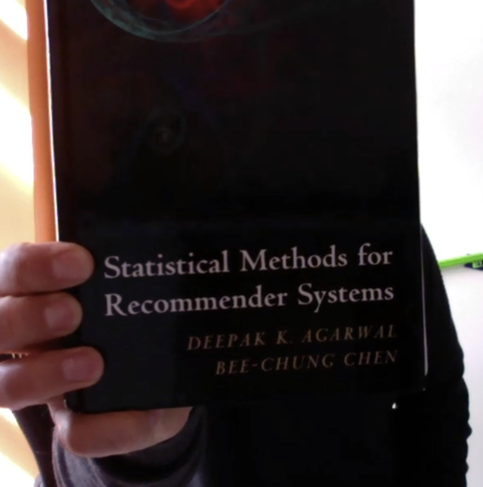

---
# Progress 22 sept

In this progress:
- RNN recommender
- Russo paper
- Idea of data1 vs data2 (rec sys data paradox)
- Implementation of first meta vector model

Things done:

#### RNN Recommender
- Partly unrelated to the phd-projects: Development of an Recurrent Neural Net recommender with evaluation of negative examples.
The model takes in a vector from one user of consumed items. Then, it tries to predict the next item the user will consume. Earlier implementations I have done has only predicted a fixed vector (that is obtained from a different model). The new sets of algorithms are actually using a logistic regression to evaluate negative examples as well. Since there are 2m negative examples at every point, it is only sampling some negative examples (15k items) due to computational constraints. By sampling negative examples, it allows the algorithm to also consider the item vectors as parameters.
- One of these has been into production at FINN.no and is one of the top performing models in the meta model. A new model using not only the sequence of items, but also the timestamp of when the item was clicked is on its way out. Further improvements such as including category of the items, the type of interaction (pageview vs sending a message on the item), is something we should try out.

- In general: Sequential recommenders (using recurrent neural nets) are becoming the industry standard at the moment.
The model is inspired by e.g. http://alexbeutel.com/papers/rrn_wsdm2017.pdf

Might be good for **supervisors** to read/skim through?

#### Russo
- Read the Russo paper "Introduction to Thompson sampling", and further discussed this with Arnoldo. An interesting discussion came out of this regarding greedy, "frequentist Thompson" and Thompson. In the context of bernoulli bandits:
 + Greedy: Estimate the click probabilities per arm and choose the highest one.
 + "Frequentist Thompson 1": Estimate the click probabilities of each arm. Then sample a bernoulli from this and take the highest sample. The idea was that you then get some exploration. REMARK NOW: Not really sure how this would work, as you would sample a sequence like (0,0,1,0,1,0). Since what you sample is binary, you cant decide between arm 3 and 5 (in this example). Improvement: Do some bootstrap where you sample each arm n times and take the average performance.
 + "Frequentist Thompson 2 (with law of large numbers)": Assume $P(success in arm 1 ) = \theta$. Sample n draws from this distribution (theta_1, theta_2, ..., theta_k). Then 1/n * sum(theta_i) is Norm(theta, sigma/sqrt(n)) (or similar). Hence we have a mechanism to reduce the uncertainty in our parameter when we have tested an arm many times. This is an important property.
 + "Proper Thompson": Bayesian: Add priors and everything...

**David**: Do you recognize frequentist thompson 1+2 by some more used names? I am sure these things have been explored in the context of bandits...

#### Data 1 vs Data 2 (the recommender system data paradox)
My head has been spinning with this concept for a while, and I believe it makes sense to write down a bit on it.
I believe there is a data paradox in recommender systems litterature:

> We do not use recommendation data to train recommender systems!

When training recommender algorithms the signals are all {user, item} iteractions done by the user, no matter how the user found the item she interacted with (Data 1). For example, if I watch an episode of Games Of Thrones on HBO, that is a positive interaction. It does not matter whether I used the search tool, got a link from a friend, or was recommended the item by HBO.

On the contrary, when we evaluate a recommender algorithm (in production) we typically look at click rates. That is, we want to choose models that are best at pickling items we will click on if shown:

> P(click | we show item i)

This is a very different problem from the one solved by using Data 1. We also have a very different dataset for this problem: the show/click events from our recommendation product. I will call this Data 2.

There is a good reason for using data 1 in building recommender systems. Usually, there is a lot more going on to an internet platform than the recommendation engine. Only using data from your rec engine will essential throw away all the useful interaction done in other parts of the platform (search engine ++). However, not using Data 2 also misses out a lot, as this contain the data of what you really want to optimize. It also allows for exploration of user preference by recommending items that is not optimal from a Data 1 point of view.

I believe that there is great potential in combining Data 1 and Data 2. The meta models is one way of doing this.


#### Implementation of Meta Bandit Vector Algorithm
I have done a first round of implementation of the meta bandit vector-algorithm (working name, suggestions welcome!). The general idea is to utilize an algorithm created in Data 1, to optimize click rates using Data 2.

##### Data 2
I am focusing on the recommendation location at the front page of FINN.no. It is a personalized feed that can show up to 48 items to a user. It starts by displaying 6, and then adds 6 and 6 as the user (potensially) scroll down the site. We log each display as an "inScreen", and log each click on either of the items as a "click".
On a daily basis, there is around 200k clicks, and we show approx 48M items to users (or 1M full 48 feeds). The probability that a users clicks on one of the 48 items is therefore around 20% (=200k/1M).

After cleaning and massaging the data, we get a table looking like this:



Here, each row is one of the 48 items shown to a user.
We register the user (userId_idx), the item proposed (itemId_idx), the position the user saw that item in (itemPos_idx), and whether the user clicked or not. In addition, we have the "reward" that FINN gets from an interaction (this is an index saying whether the user converted and on what kind of item the user converted), as well as a lot of normalizing variables: weekday, hour of day, device (mobile/desktop) and location (only frontpage now).

##### The first meta vector bandit

> Idea: We use pretrained algorithms in data 1-land to improve our model trained in data 2-land.

We have:
- the data specified in Data 2 above.
- A set of pre-trained vectors $x_u \in Rˆd$, for all users $u = (1,.., N_u)$
- A set of pre-trained vectors $y_i \in Rˆd$, for all items $i = (1,.., N_u)$
- All our normalizing variables are one-hot encoded, and given parameters w_{weekday}, w_{itemPos}, ...

For every data point, we wish to model the click probability.

Create a variable that we will call the CF-score by the following:
$$
CF(X) = x_uˆT y_i
$$

Define a vector of the CF score and all normalizing parameters:

$$
Z = [CF(X), w_{weekday}, w_{itemPos}, ... ]
$$

Then, transform Z into 2 values representing the logits of click probability:

$$
\alpha = BZ + c
$$
where B is a parameter vector, and c is a constant.

Finally, the click probability is modeled as:

prob(click | X) = \frac{exp(\alpha[1])} {exp( \alpha[1] + \alpha[2])}

The following code implements this model as a pytorch model:

``` python
class BanditVec(nn.Module):
    def __init__(self, pretrained_weights, norm_ind2val):
        super(BanditVec, self).__init__()

        ### Layers
        self.scalelayer = nn.Linear(len(norm_ind2val.keys()) + 1,2)

        ### User Item Embeddings
        self.emb = nn.ModuleDict()
        for name, w in pretrained_weights.items():
            self.emb[name] = (nn.Embedding(num_embeddings=w.shape[0],
                                          embedding_dim=w.shape[1])
                              .from_pretrained(torch.from_numpy(w).float(), freeze= True)
                             )

        ### NORMALIZE EMBEDDINGS
        self.normemb = nn.ModuleDict()
        for name, _ in norm_ind2val.items():
            self.normemb[name] = (nn.Embedding(num_embeddings = len(norm_ind2val[name]) ,
                                          embedding_dim = 1)
                             )

    def cf_score(self, batch):
        uservec = self.emb['userId'](batch['userId_idx']).squeeze()
        itemvec = self.emb['itemId'](batch['itemId_idx']).squeeze()

        score = (uservec * itemvec).sum(dim=1, keepdim = True)
        return score

    def forward(self, batch):

        # Calculate the score between user and item by multiplying pre-trained
        # user/item vectors (divide by 100 for numerical stability):
        score = self.cf_score(batch)/100

        # Add one hot encoded covariates from the normalizing variables:
        normscorelist = []
        for col in norm_ind2val.keys():
            s = self.normemb[col](batch[col + "_idx"]).view(-1,1)
            normscorelist.append(s)

        # Add the user/item score to the list of covariates
        # and concat them into a vector
        normscorelist.append(score)
        covariates = torch.cat(normscorelist, dim=1)

        # Do a linear regression layer on the covariates
        # and produce two logits:

        score = self.scalelayer(covariates)

        return score

```

I have done a fast training of this model on a subset of the data described above. I use the crossEntropy Loss to minimize the function.

The loss converges fine, and by inspecting the model, I do get some statistics out that makes it seem to converge to something useful. For example, there is a positive relationship between the cf score and the probability of click (logit value in y axis):


 

The same plot also shows that the click probabilities decreases as item Position increase. It can also be seen by inspecting the $w_{item_pos}$ directly: (note that these plots may be inverted around zero as it is only an input to a regression model and gets multiplied by an arbitrary weight parameter)



Also, the model finds a "smooth" relation to the hour of day:


There is much more we can say about this, but Ill stop here. There is also many extension we can do, like the xWy translation of the vectors I proposed earlier. (I actually implemented this, but Ill present results later).

# 14 sept -  Progress meeting

Arnoldo, David and Simen agreed that the vector-bandit model note is a good start. No need to focus very much on whether it is bayesian or not: "make it work first".

#### Until next time:
- Read the Russo paper (https://arxiv.org/abs/1707.02038)
- Build a first iteration of the vector bandit and present to group.

---

## 11. sept: Skype with David
Quick chat with David. I showed him my ideas for how to build a bandit:



General feedback: this is the right way. Go fit some data to this setup.
- Misspelling in bottom half: $a_n$ and $y_a_n$ is the same thing.


Possible readings:

- This book has some models that are similar:


- Microsoft paper on large scale click prediction:
http://quinonero.net/Publications/AdPredictorICML2010-final.pdf

- Lastly, possible tutorials on bandits:

  + Steve Scott is a good place to quickly get up to speed on bandits: <http://www.economics.uci.edu/~ivan/asmb.874.pdf>.

  + There’s a good tutorial on the theory of these things at <https://pdfs.semanticscholar.org/presentation/a32b/b67c2d1cc4d03219ec554557b80e4a335073.pdf>, but it’s pretty heavy going if you just want to use them.
  + I hear the recent tutorial by Russo and Van Roy <https://arxiv.org/abs/1707.02038> is quite good too - certainly the abstract is promising!


# Progress 3. sept 2018

What I have done:
- Lancaster Kickoff
- phd funding application
- Start ideas on making a meta-recommender based on pretrained vectors
- Reading&ex in course
- Partly on side: Implemented a Recurrent NN recommender that tries to predict probability of what item will be consumed next. In A/B testing now. (http://dx.doi.org/10.1145/3018661.3018689)

Next steps and ideas as discussed (and self planned) after Lancaster kick-off:
- finish funding application
- Bayesianify the meta model in some way.
- One problem is that these submodels does not contain any really «large» uncertainty: A bad submodel may give a score of 0.5 to one relevant and one irrelevant item. The meta model cant really use this to determine between the two.
- The real uncertainty may be within the submodel
- Might be more interesting to consider the vector spaces from submodels and their translation into a reward function (click prob). More general, and more usable in different scenarios. Also allows the action space to be all items in inventory, not just (top k)*(# submodels).
- 	For this missing vectors need to be considered.
- 	Is it a problem that training data may be older than vector generation?
- 	Should this «super model» contain latent variables itself?
-      The "agility" of models such as "similar to last seen" and "Popular" will not be able to be as dynamic in the new setup.. this will hurt relevance during production.

Other interesting things Id like to try:
- How to use mcmc when data increase/change?
