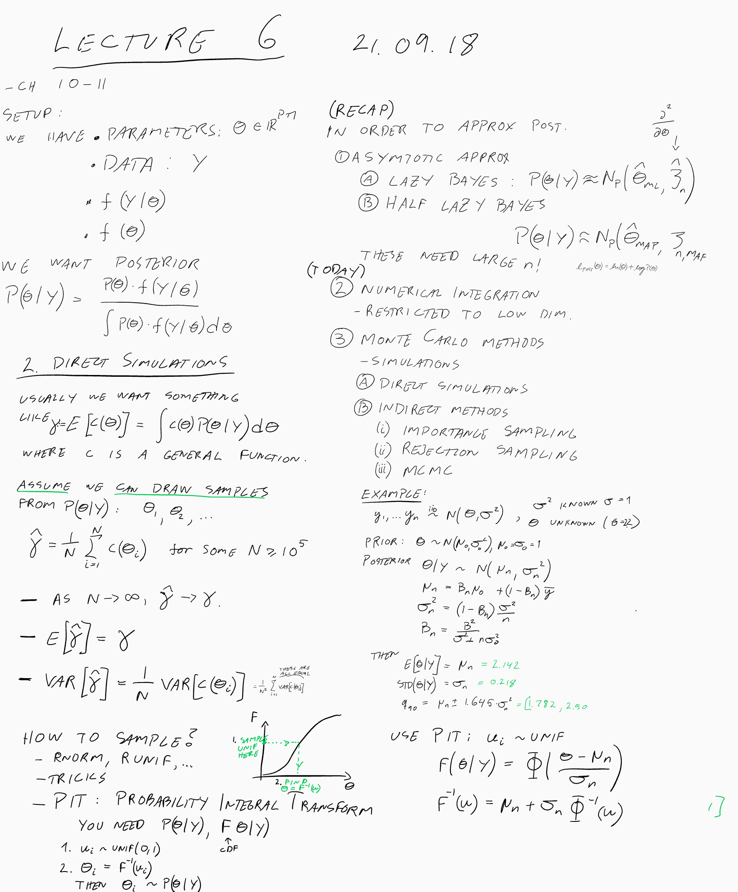
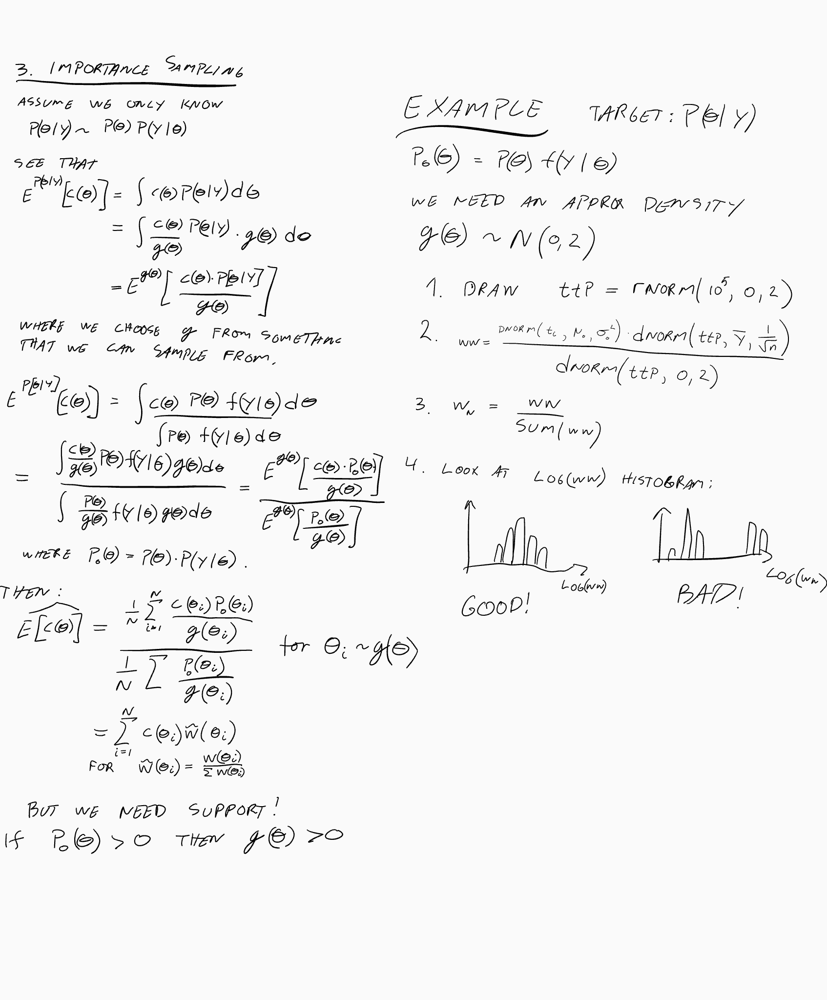
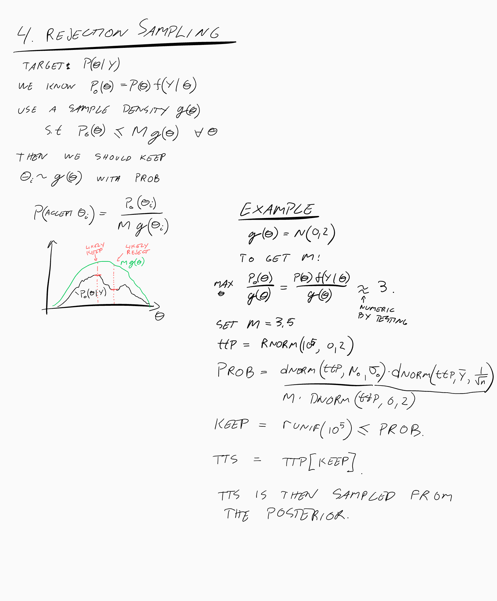
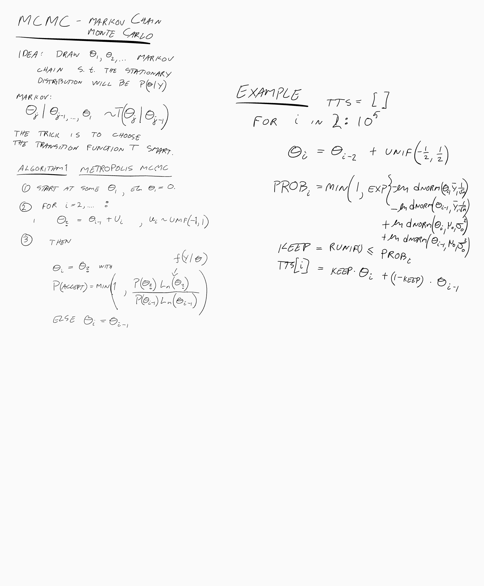
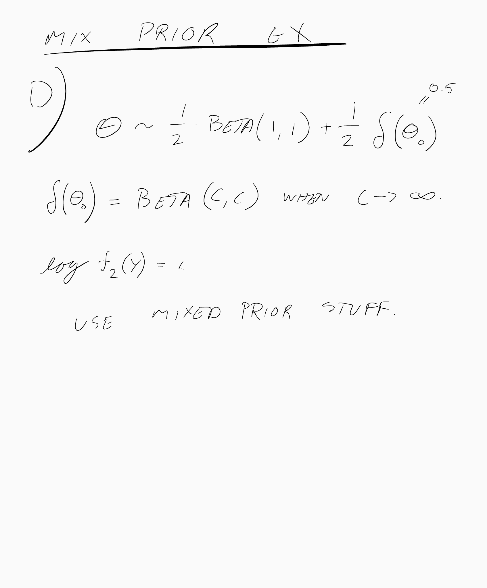

## Computation

## Importance sampling

## Rejection-Accept

## MCMC

## Exercise

### Small Mixture Prior exercise (coin flipping):
you flip a coin n = 25 times and observe y = 10 Heads.
Find the posterior density of theta = Pr(head), along with "standard summary numbers", namely
- posterior mean,
- posterior standard deviation,
- 0.05, 0.50, 0.95 posterior quantiles,
for each of the following priors:

#### (a) theta is uniform on (0,1) (which is where Thomas Bayes started, in 1763).

Bomma her: E(theta | y) = 11/27. Altså: n+2 = 27 ikke 26. Da stemmer det med simuleringen under.

#### (b) theta is a Beta(c,c), with a high c, like c = 100.

Løsning: Skulle vært beta(110, 115) ikke 109,114

#### (c) theta is a mixure 0.50 * uniform + 0.50 * Beta(c,c).

Løsning: Bruk de "nye" vektene definert i forelesing 4 om mixture priors.

#### (d) theta is a mixture 0.50 * uniform + 0.50 * unit-point-mass-at-0.50.

Use the trick that when c -> Inf, then beta(c,c) becomes a dirichlet distr with mean 0.5:

Finish exercises from last time (if you did not do them last week).

last week:
- Nils Exercise 13, about the Dirichlet-Multinomial. Do not use too much energy on questions a) and b), as I do not consider them as very central.

- Nils Exercise 14, applications of the Dirichlet-Multinomial. Question b) is difficult, but do as much as you can.

- Nils Exercise 22, on the Gamma-Normal conjugate prior for the normal model. Do not spend time on question b), as we have not learnt this yet. Instead I added a question c*): show that the marginal prior distribution of \mu is a t distribution. The dataset for question f) is found here.

Nils Exercise 9 e) (read through the rest of Exercise 9, you should be able to use the theory described there, but you do not need to work through the details).
