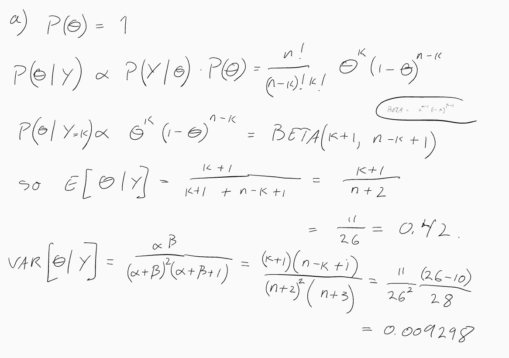
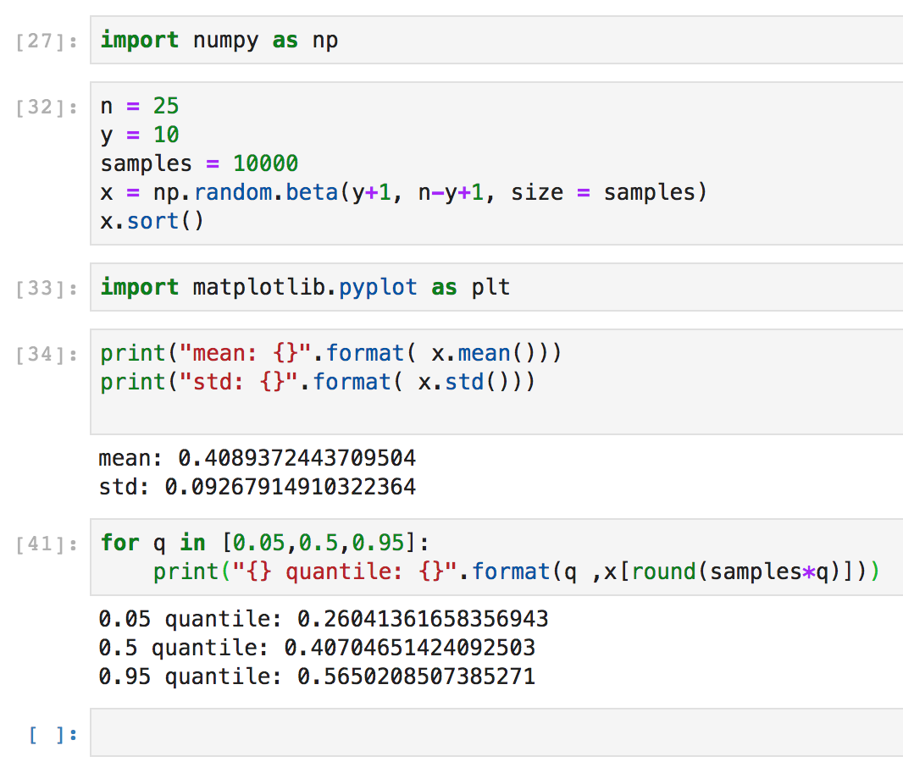
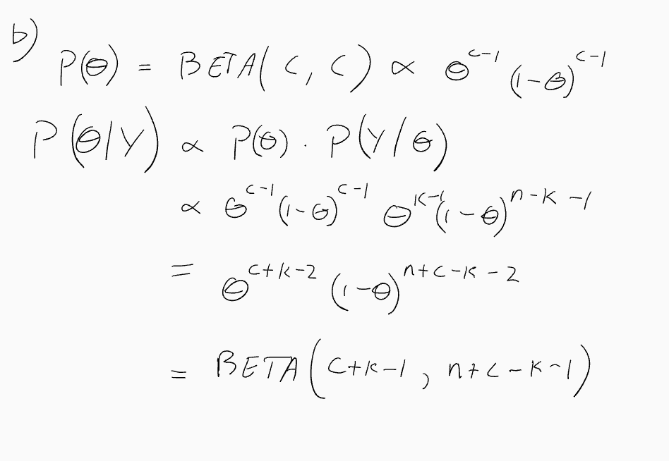
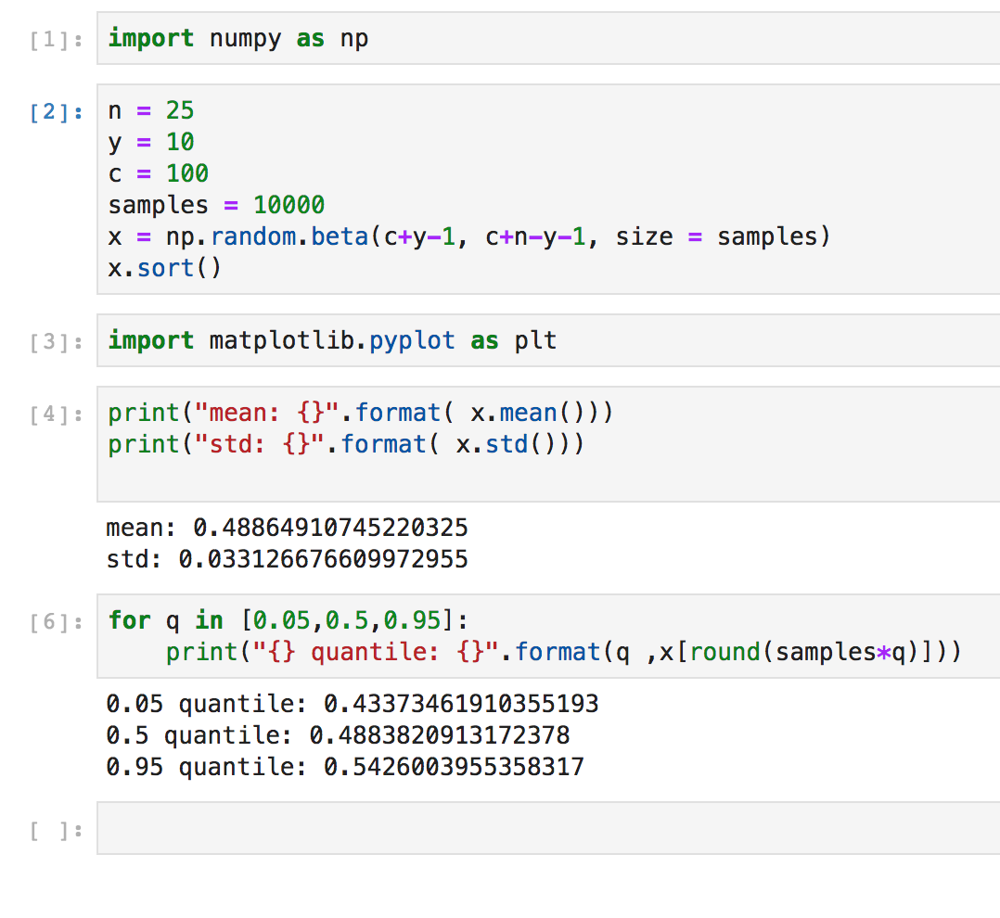
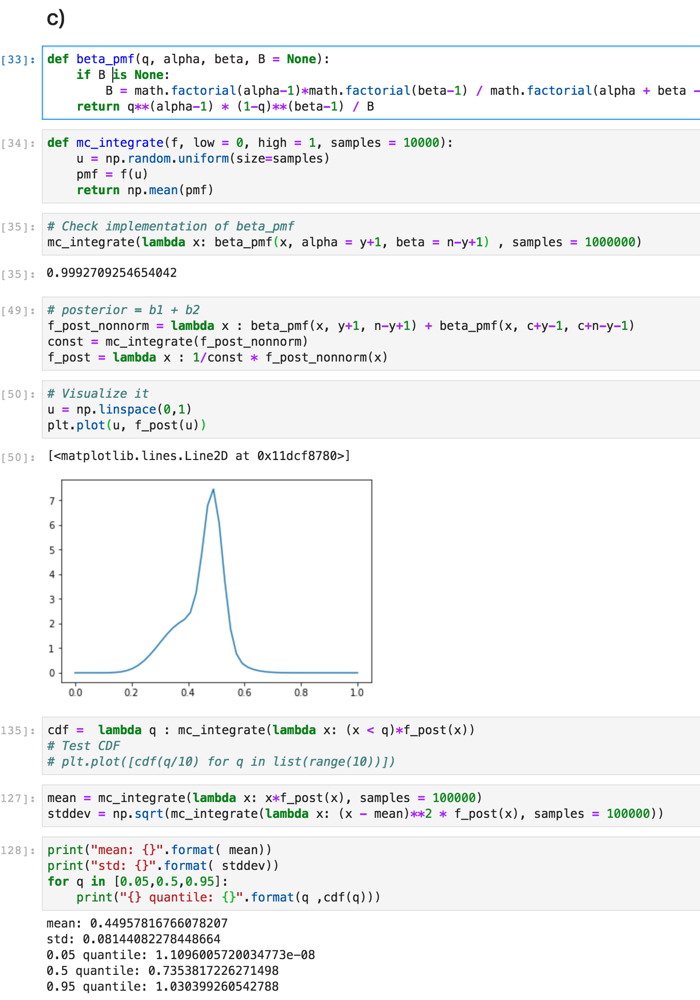

## Exercise

### Small Mixture Prior exercise (coin flipping):
you flip a coin n = 25 times and observe y = 10 Heads.
Find the posterior density of theta = Pr(head), along with "standard summary numbers", namely
- posterior mean,
- posterior standard deviation,
- 0.05, 0.50, 0.95 posterior quantiles,
for each of the following priors:

(a) theta is uniform on (0,1) (which is where Thomas Bayes started, in 1763).

(b) theta is a Beta(c,c), with a high c, like c = 100.

(c) theta is a mixure 0.50 * uniform + 0.50 * Beta(c,c).

(d) theta is a mixture 0.50 * uniform + 0.50 * unit-point-mass-at-0.50.

Finish exercises from last time (if you did not do them last week).

Nils Exercise 9 e) (read through the rest of Exercise 9, you should be able to use the theory described there, but you do not need to work through the details).
